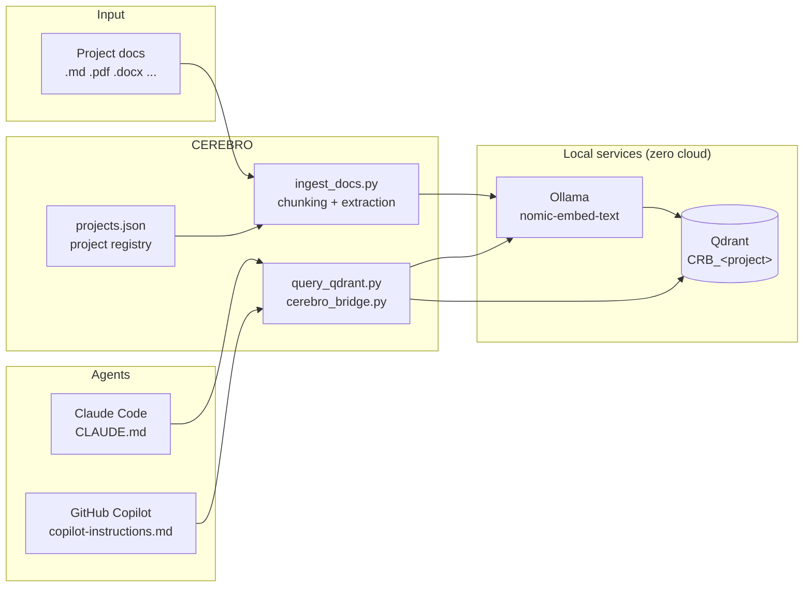

<p align="center">
  
</p>

<p align="center">
  <a href="LICENSE"></a>
  
  
  
  
</p>

# CEREBRO — the external brain for your projects

CEREBRO is a local, multi-project RAG system. It indexes context, documentation and code of N projects into Qdrant.
Each project gets its own collection: project `helix` → collection `CRB_helix`.
Everything runs on your machine — embeddings via Ollama, vector storage via Qdrant. Zero cloud, zero API keys.

> **First install?** See [INSTALL.md](INSTALL.md) — prerequisites (Qdrant, Ollama, venv) and `/cerebro` skill / Copilot integration setup.

## How it works



## `/cerebro` skill (recommended path)

Claude Code has a **`/cerebro`** skill (source in [`skills/cerebro/SKILL.md`](skills/cerebro/SKILL.md)): an interactive guide for every operation in this README — new project, re-index, status, removal — with question-based data collection, prerequisite checks (Qdrant/Ollama/venv) and final verification. To install it, copy the `skills/cerebro/` folder to `%USERPROFILE%\.claude\skills\` and set the `CEREBRO_HOME` environment variable (see INSTALL.md).

The commands below remain the manual reference (and what the skill runs under the hood).

## Full setup for a new project

> Via skill: `/cerebro` → **New project**. The steps below are the manual equivalent.

Example with project `helix` in `C:\Progetti\helix`. Prerequisites: Qdrant and Ollama running, virtualenv created (see sections below). All commands run from the CEREBRO repo root.

**1. Register the project** — tells CEREBRO where docs and root are:

```powershell
python scripts\register_project.py add helix --docs "C:\Progetti\helix\docs" --root "C:\Progetti\helix"
```

Multiple docs folders/files: `--docs <path1> <path2> ...`. Without registration the default is `projects\helix\docs` inside the repo.

**2. Index the documents** — creates the `CRB_helix` collection and uploads the embeddings:

```powershell
python scripts\ingest_docs.py --project helix
```

**3. Generate agent instructions** — creates `CLAUDE.md` (Claude Code) and `.github\copilot-instructions.md` (Copilot) in the project, pointing to `CRB_helix`:

```powershell
python scripts\register_project.py instructions helix
```

Only one of them: `--tool claude` or `--tool copilot`.

**4. Verify** — count indexed chunks and try a search:

```powershell
python scripts\query_qdrant.py --project helix count
python scripts\query_qdrant.py --project helix search "architecture" --limit 3
```

Done. From now on, the agent (Claude Code or Copilot) working in `C:\Progetti\helix` finds in the generated instructions the command to query `CRB_helix`.

### Project maintenance

> Via skill: `/cerebro` → **Re-index** / **Status** / **Remove project**.

- **Docs changed**: re-run step 2 (upsert: updated chunks are overwritten).
- **New docs folder**: repeat step 1 with the updated list, then step 2.
- **Remove a document**: `python scripts\remove_doc.py --project helix --source "relative\path\file.md"`.
- **Retire a project**: `python scripts\register_project.py remove helix`, then manually delete the `CRB_helix` collection from Qdrant if no longer needed.

## Prerequisites

- Python 3.10+
- Ollama running at `http://localhost:11434`
- Qdrant running at `http://localhost:6333`

## Installing Qdrant with Docker

First check if Qdrant is already up:

```powershell
curl http://localhost:6333/collections
```

If it responds (even with a JSON error), Qdrant is already there: skip this section.

If it doesn't respond, you need Docker Desktop installed and running. Then:

```powershell
# pull the image (first time only)
docker pull qdrant/qdrant

# start the container with a persistent volume
docker run -d --name qdrant -p 6333:6333 -p 6334:6334 -v qdrant_storage:/qdrant/storage qdrant/qdrant
```

Verify:

```powershell
curl http://localhost:6333/collections
```

Expected: a JSON response with the collection list (initially empty).

Container management:

```powershell
docker stop qdrant     # stop
docker start qdrant    # restart (data kept in the volume)
docker logs qdrant     # logs
```

Data (collections and embeddings) stays in the `qdrant_storage` volume even after stop/restart or image upgrades.

Optional web dashboard: `http://localhost:6333/dashboard`.

## Installing the embedding model on Ollama

```bash
ollama pull nomic-embed-text
```

Verify:
```bash
curl http://localhost:11434/api/embeddings -d '{"model":"nomic-embed-text","prompt":"test"}'
```
```powershell
Invoke-RestMethod -Uri "http://localhost:11434/api/embeddings" -Method Post -ContentType "application/json" -Body '{"model":"nomic-embed-text","prompt":"test"}'
```


## Creating the virtualenv and installing dependencies

From the CEREBRO repo root:

```powershell
python -m venv .venv
.venv\Scripts\Activate.ps1
pip install -r requirements.txt
```

Then activate the venv in each session (`.venv\Scripts\Activate.ps1`) or invoke `.venv\Scripts\python scripts\...` directly.

## Configuration

Copy `.env.example` to `.env` and adjust if needed:

```properties
QDRANT_URL=http://localhost:6333
OLLAMA_URL=http://localhost:11434
EMBEDDING_MODEL=nomic-embed-text
EMBEDDING_DIM=768
# PROJECT=   (optional: default project)
```

The collection name is NOT in `.env`: it derives from the project (`CRB_<slug>`).

## Projects: registry and selection

Every script accepts `--project <name>`. Alternatively set the `PROJECT` environment variable.

Registry `projects.json` (git-ignored; see `projects.example.json`): maps project → docs folders.

```powershell
# register a project with external docs (multiple paths allowed)
python scripts\register_project.py add helix --docs "C:\Progetti\helix\docs" --root "C:\Progetti\helix"

# list projects
python scripts\register_project.py list

# remove from registry (the Qdrant collection stays)
python scripts\register_project.py remove helix
```

Without registration, the default is `projects\<name>\docs` inside the repo.
Names are sanitized: `My App` → slug `my_app` → collection `CRB_my_app`.

## Instructions for Claude Code / GitHub Copilot

Generate instruction files in the project pointing to its collection:

```powershell
# both: CLAUDE.md + .github\copilot-instructions.md
python scripts\register_project.py instructions helix

# only one of them
python scripts\register_project.py instructions helix --tool claude
python scripts\register_project.py instructions helix --tool copilot
```

Requires the project root (from `--root` in `add` or the `--root` flag here).
The inserted block is delimited by `<!-- CEREBRO:START/END -->`: re-running updates the block without duplicating it; the rest of the file is untouched.

## Document ingestion

Index the project's docs (from registry or default):

```powershell
python scripts\ingest_docs.py --project helix
```

One-shot path override (without touching the registry):

```powershell
python scripts\ingest_docs.py --project helix "C:\other\path\docs"
```

The `CRB_helix` collection is created automatically if missing.

### Supported formats

| Format | Extraction |
|---|---|
| `.md`, `.txt` | direct read |
| `.pdf`, `.docx`, `.xlsx`, `.pptx`, `.html`, `.htm` | Markdown conversion via [markitdown](https://github.com/microsoft/markitdown) (dependency in `requirements.txt`) |

Files with other extensions are ignored. Note: scanned PDFs (images only) contain no extractable text — external OCR needed. A single file can be indexed by passing it as a path: `python scripts\ingest_docs.py --project helix "C:\docs\specs.pdf"`.

## Query

Semantic search:
```powershell
python scripts\query_qdrant.py --project helix search "worktree support" --limit 5
```

Point count:
```powershell
python scripts\query_qdrant.py --project helix count
```

Scroll points:
```powershell
python scripts\query_qdrant.py --project helix scroll --limit 10
```

## Removing a document

```powershell
python scripts\remove_doc.py --project helix --source "folder\FILE.md"
```

`--source` is the path relative to the indexed folder (as it appears in the payload).

## Enriched prompt bridge

```powershell
python scripts\cerebro_bridge.py --project helix "how do I implement worktree support?"
```

Prints a prompt enriched with context from the documents, ready to give to any agent (Claude Code, Copilot, other). If the `gh` CLI is available, it automatically invokes `gh copilot suggest`.

## Recommended PowerShell aliases

Add to your PowerShell profile (`$PROFILE`), replacing `<CEREBRO_HOME>` with the folder where you cloned the repo:

```powershell
# query with RAG context
function cerebro-ask { <CEREBRO_HOME>\.venv\Scripts\python "<CEREBRO_HOME>\scripts\cerebro_bridge.py" $args }

# ingestion: index/update a project's docs
function cerebro-ingest { <CEREBRO_HOME>\.venv\Scripts\python "<CEREBRO_HOME>\scripts\ingest_docs.py" $args }
```

Usage:
```powershell
cerebro-ask --project helix "how do I implement feature F09?"
cerebro-ingest --project helix                      # from registry/default
cerebro-ingest --project helix "C:\other\docs"      # one-shot path override
```

To avoid repeating `--project`, set `$env:PROJECT = "helix"` in the session.

---

## Daily usage (post-install)

Install once. This is the everyday workflow.

### 1. Start the services

```powershell
docker start qdrant      # Qdrant (if not already up)
ollama serve             # Ollama (if not already up; often auto-starts on Windows)
```

Quick check: `curl http://localhost:6333/collections` and `curl http://localhost:11434`.

### 2. Work on an already-configured project

Open the project (`C:\Progetti\helix`) in VS Code or a terminal and work normally with Claude Code or Copilot: the generated instructions (`CLAUDE.md` / `copilot-instructions.md`) tell the agent how to query `CRB_helix`. No other manual step.

Manual query when needed:

```powershell
$env:PROJECT = "helix"    # once per session
cerebro-ask "how do I implement feature F09?"
```

### 3. Keep the brain up to date

When you add or change project documentation:

```powershell
python scripts\ingest_docs.py --project helix
```

Ingestion is incremental per path: chunks of the same file are overwritten, not duplicated. Document deleted from the project → remove it from the index too with `remove_doc.py`.

### 4. New project

Via skill in Claude Code: `/cerebro` → **New project** (guided). Manual: "Full setup for a new project" at the top, 4 steps (register → index → instructions → verify).

### Quick diagnosis checklist

| Symptom | Likely cause | Fix |
|---|---|---|
| `Connection refused :6333` | Qdrant down | `docker start qdrant` |
| `Connection refused :11434` | Ollama down | `ollama serve` |
| `Collection doesn't exist` | never ingested | step 2 of setup |
| `Project not specified` | missing `--project` and `PROJECT` | flag or `$env:PROJECT` |
| Stale results | docs changed | re-ingest |

---

## Prompt for GitHub Copilot (session inside a project)

Copy the following text at the start of a Copilot session in the project (replace `<name>` and paths):

```text
I am working on the <name> project.
Its documentation is semantically indexed in the Qdrant collection CRB_<name> at http://localhost:6333.
Embeddings are generated via Ollama with the nomic-embed-text model at http://localhost:11434.
The RAG (retrieval) tool is located at <CEREBRO_HOME>\scripts\cerebro_bridge.py.

Before answering questions about architecture, features, agents, skills, worktrees, compliance or development plans:
- retrieve relevant context from the CRB_<name> collection via vector search;
- do not assume project conventions unless verified in the retrieved documents;
- if you modify code, check consistency with the documented conventions.
```

Alternative: save the text to `.github/copilot-instructions.md` inside the project for automatic loading by Copilot Chat in VS Code (`register_project.py instructions` does this).

## Development

```powershell
pip install -r requirements-dev.txt
pytest tests/
```

## License

[MIT](LICENSE) © 2026 Marco Scibetta
