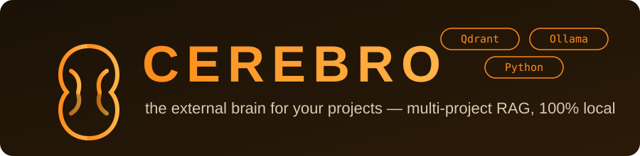
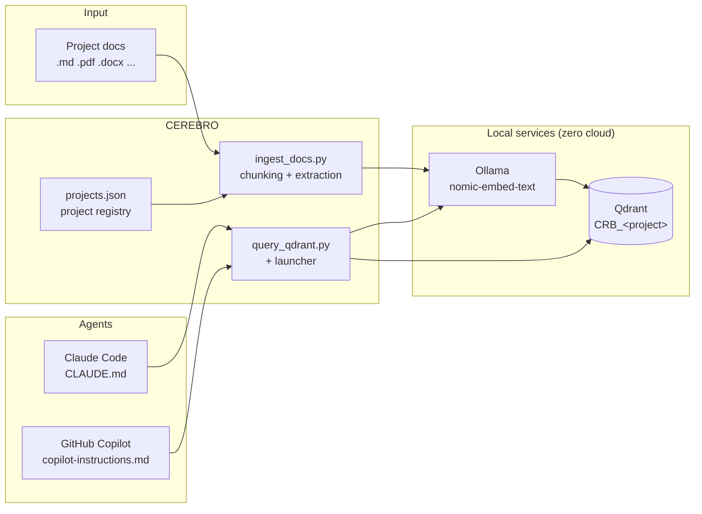

<p align="center">
  
</p>

<p align="center">
  <a href="LICENSE"></a>
  
  
  
  
  <a href="https://www.tiktok.com/@fortresssolitude/video/7670279294580559126"></a>
</p>

# CEREBRO — the external brain for your projects

## What is CEREBRO

CEREBRO is a local, multi-project **RAG** (Retrieval-Augmented Generation) system.

AI coding agents (Claude Code, GitHub Copilot, …) forget your project docs at every session and know nothing about your architecture, conventions or specs. CEREBRO fixes this: it indexes your project documentation into a **semantic vector database** and gives agents a way to query it while they work.

- **Multi-project**: every project gets its own isolated collection — project `helix` → collection `CRB_helix`. One brain, many projects, no cross-contamination.
- **100% local**: embeddings via Ollama, vector storage via Qdrant. No cloud, no API keys, your docs never leave your machine.
- **Agent-native**: CEREBRO generates ready-made `CLAUDE.md` / `copilot-instructions.md` blocks so agents learn how to query the brain by themselves.

> ▶ **60-second demo:** [watch CEREBRO on TikTok](https://www.tiktok.com/@fortresssolitude/video/7670279294580559126)

## How it works



**Write path (indexing):**

1. You register a project: name + docs folders + project root. Stored in `projects.json` (the registry).
2. `ingest_docs.py` extracts text from your docs (`.md`, `.txt` directly; `.pdf`, `.docx`, `.xlsx`, `.pptx`, `.html` via [markitdown](https://github.com/microsoft/markitdown)), splits it into overlapping chunks (~100 words each).
3. Each chunk is embedded locally by Ollama (`nomic-embed-text`, 768-dim vectors) and upserted into the project's Qdrant collection `CRB_<slug>` with metadata (source file, title, chunk index).
4. Re-ingesting is incremental per file: chunks of the same file are overwritten, not duplicated.

**Read path (query):**

1. The agent (or you) sends a question to `query_qdrant.py` (or the launcher's Query tab).
2. The question is embedded with the same model, and Qdrant returns the most semantically similar chunks.
3. The agent reads the retrieved context and answers grounded in your actual docs — no invented conventions.

The `instructions` command writes a `<!-- CEREBRO:START/END -->` block into the project's `CLAUDE.md` and/or `.github/copilot-instructions.md`, so the agent discovers the query command automatically at every session. Add `--graphify` to also include a `<!-- GRAPHIFY:START/END -->` block with code-level knowledge graph rules (`graphify query`, `graphify path`, `graphify explain`, `graphify update .`). Re-running updates both blocks without touching the rest of the file.

## Prerequisites

| Component | What it is | Why CEREBRO needs it |
|---|---|---|
| **Python 3.10+** | Runtime for the scripts | All CEREBRO scripts are Python |
| **Docker Desktop** | Container runtime | Runs the Qdrant container |
| **Qdrant** | Vector database (port 6333) | Stores chunk vectors + metadata, answers similarity searches |
| **Ollama** | Local model server (port 11434) | Generates embeddings — no cloud calls |
| **nomic-embed-text** | Embedding model (~274 MB) | The model that turns text into 768-dim vectors, pulled via Ollama |
| **Python venv** | Isolated environment | Keeps CEREBRO dependencies out of your system Python |

## Installation

One-time setup. All commands run from the CEREBRO repo root.

### 1. Qdrant (vector database)

Requires Docker Desktop installed and running.

```powershell
# pull the image (first time only)
docker pull qdrant/qdrant

# start the container with a persistent volume
docker run -d --name qdrant -p 6333:6333 -p 6334:6334 -v qdrant_storage:/qdrant/storage qdrant/qdrant
```

Verify — expected: a JSON response with the collection list (initially empty):

```powershell
curl http://localhost:6333/collections
```

Container management:

```powershell
docker stop qdrant     # stop
docker start qdrant    # restart (data kept in the volume)
docker logs qdrant     # logs
```

Data (collections and embeddings) stays in the `qdrant_storage` volume even after stop/restart or image upgrades. Optional web dashboard: `http://localhost:6333/dashboard`.

### 2. Ollama + embedding model

Install [Ollama](https://ollama.com), then pull the embedding model:

```powershell
ollama pull nomic-embed-text
```

Verify — expected: `Ollama is running`, then a JSON with an `embedding` array:

```powershell
curl http://localhost:11434
Invoke-RestMethod -Uri "http://localhost:11434/api/embeddings" -Method Post -ContentType "application/json" -Body '{"model":"nomic-embed-text","prompt":"test"}'
```

### 3. Clone, virtualenv and dependencies

```powershell
git clone https://github.com/odyssey2073/cerebro.git
cd cerebro
python -m venv .venv
.venv\Scripts\Activate.ps1
pip install -r requirements.txt
copy .env.example .env
```

Then activate the venv in each session (`.venv\Scripts\Activate.ps1`) or invoke `.venv\Scripts\python scripts\...` directly.

The default configuration in `.env` is already correct for a standard local install:

```properties
QDRANT_URL=http://localhost:6333
OLLAMA_URL=http://localhost:11434
EMBEDDING_MODEL=nomic-embed-text
EMBEDDING_DIM=768
# PROJECT=   (optional: default project)
```

Edit it only if the services run on different hosts/ports. The collection name is NOT in `.env`: it derives from the project name (`CRB_<slug>`).

### 4. CEREBRO Launcher (web SPA)

A single local web interface for **both Claude Code and GitHub Copilot** — no
per-tool skill or CLI. It manages new project, re-index, status, remove and query
from the browser:

```powershell
python scripts\cerebro-launcher.py
```

Opens http://127.0.0.1:8789. From the UI:

| Action | What it does |
|---|---|
| **New project** | name, root, docs paths, agent tools (`both`/`claude`/`copilot`), Graphify, extra collections → registers, indexes, generates instructions, verifies |
| **Re-index** | Updates the brain after docs changed |
| **Status** | Table of projects, collections, chunk counts, service health |
| **Query** | Semantic search with results (score, collection, source, text, images) |
| **Remove project** | Removes from registry (collection deletion always double-confirmed, never automatic) |

The launcher drives the same core scripts below. Both agents use it identically;
per-project query context is still generated automatically (see "Agent instructions").

### Manual commands (CLI)

Every script accepts `--project <name>` (or the `PROJECT` env var). Project names are sanitized: `My App` → slug `my_app` → collection `CRB_my_app`.

| Command | Purpose |
|---|---|
| `register_project.py add <name> --docs <paths...> [--root <path>]` | Register a project: docs folders + root |
| `register_project.py list` | List registered projects, collections, docs paths |
| `register_project.py remove <name>` | Remove from registry (Qdrant collection stays) |
| `register_project.py instructions <name> [--tool claude\|copilot\|both] [--graphify]` | Generate/update `CLAUDE.md` and/or `copilot-instructions.md` in the project. `--graphify` adds a code-level knowledge graph block |
| `ingest_docs.py --project <name> [paths...]` | Index (or re-index) the project's docs into Qdrant |
| `query_qdrant.py --project <name> search "<query>" [--limit N] [--source F]` | Semantic search over the project's chunks |
| `query_qdrant.py --project <name> count` | Count indexed points |
| `query_qdrant.py --project <name> scroll [--limit N] [--offset N]` | Browse raw points |
| `remove_doc.py --project <name> --source "<relative path>"` | Remove one document's chunks from the index |

### Full setup for a new project

> Via launcher: **New project**. The steps below are the manual equivalent.

Example with project `helix` in `C:\Progetti\helix`. Prerequisites: Qdrant and Ollama running.

**1. Register the project** — tells CEREBRO where docs and root are:

```powershell
python scripts\register_project.py add helix --docs "C:\Progetti\helix\docs" --root "C:\Progetti\helix"
```

Multiple docs folders/files: `--docs <path1> <path2> ...`. Without registration the default is `projects\helix\docs` inside the repo.

**2. Index the documents** — creates the `CRB_helix` collection and uploads the embeddings:

```powershell
python scripts\ingest_docs.py --project helix
```

One-shot path override (without touching the registry): `python scripts\ingest_docs.py --project helix "C:\other\docs"`. A single file works too: `... "C:\docs\specs.pdf"`.

**3. Generate agent instructions** — creates `CLAUDE.md` (Claude Code) and `.github\copilot-instructions.md` (Copilot) in the project, pointing to `CRB_helix`:

```powershell
python scripts\register_project.py instructions helix
# only one of them:
python scripts\register_project.py instructions helix --tool claude
python scripts\register_project.py instructions helix --tool copilot
# include Graphify code-level knowledge graph block:
python scripts\register_project.py instructions helix --tool both --graphify
```

### Claude Code configuration (CLAUDE.md)

When `--tool claude` (or `both`) is used, `register_project.py instructions` writes
a `<!-- CEREBRO:START/END -->` block into the project's `CLAUDE.md`. Claude Code
reads this file automatically at session start, gaining the ability to query the
project's Qdrant collection for documentation context.

If `--graphify` is also passed, a `<!-- GRAPHIFY:START/END -->` block is appended
with rules for the Graphify code-level knowledge graph (`graphify query`,
`graphify path`, `graphify explain`, `graphify update .`).

Generated `CLAUDE.md` structure:
```
<!-- CEREBRO:START -->
## CEREBRO RAG — project context
...query command + rules...
<!-- CEREBRO:END -->

<!-- GRAPHIFY:START -->      ← only with --graphify
## Graphify — Knowledge Graph (code)
...graphify commands + rules...
<!-- GRAPHIFY:END -->
```

### GitHub Copilot configuration (.github/copilot-instructions.md)

When `--tool copilot` (or `both`) is used, the same blocks are written to
`.github/copilot-instructions.md`. GitHub Copilot Chat loads this file
automatically — same structure, same rules, same query capabilities as Claude Code.

Both files are kept in sync: re-running `instructions` updates the blocks in place
without touching the rest of the file. No manual editing needed after initial setup.

**4. Verify** — count indexed chunks and try a search:

```powershell
python scripts\query_qdrant.py --project helix count
python scripts\query_qdrant.py --project helix search "architecture" --limit 3
```

Done. From now on, the agent working in `C:\Progetti\helix` finds the query command in the generated instructions.

### Daily usage

```powershell
# start the services (if not already up)
docker start qdrant
ollama serve

# docs changed? re-index (incremental per file)
python scripts\ingest_docs.py --project helix

# manual query
python scripts\query_qdrant.py --project helix search "how do I implement feature F09?" --limit 5
```

Project maintenance:

- **Docs changed** → re-run ingest (upsert, no duplicates).
- **New docs folder** → `register_project.py add` with the updated list, then ingest.
- **Document deleted** → `remove_doc.py --project helix --source "folder\FILE.md"` (`--source` is the path relative to the indexed folder, as shown in the payload).
- **Retire a project** → `register_project.py remove helix`, then delete the Qdrant collection manually if needed: `curl -X DELETE http://localhost:6333/collections/CRB_helix`.

### Supported document formats

| Format | Extraction |
|---|---|
| `.md`, `.txt` | direct read |
| `.pdf`, `.epub` | Markdown **with extracted images** (see below) |
| `.docx`, `.xlsx`, `.pptx`, `.html`, `.htm` | Markdown conversion via [markitdown](https://github.com/microsoft/markitdown) (no images) |

Files with other extensions are ignored. Note: scanned PDFs (images only, no text layer) contain no extractable text — avoid them (external OCR is out of scope).

### Images and figures (PDF / EPUB)

For `.pdf` and `.epub` books, images are **extracted and linked** into the Markdown:

- assets in `assets\<slug>\<source>\document.md` + `images\fig_NNNN.png` (persisted markdown, relative `images/...` links);
- each Qdrant chunk carries `image_paths` (absolute Windows paths, for Claude's `Read` tool) and `image_urls` (`http://localhost:<port>/...`, for the browser).

Ingest auto-starts the static image server (port `IMAGES_PORT`, default `8777`) if it is not already running. Manual start:

```powershell
.venv\Scripts\python scripts\serve_images.py
```

In a search result, the chunk text is shown plus `Image: <url>` and `Path: <path>` lines: Claude opens the `path` with `Read` and sees the figure; you open the `url` in the browser.

### Quick diagnosis

| Symptom | Likely cause | Fix |
|---|---|---|
| `Connection refused :6333` | Qdrant down | `docker start qdrant` |
| `Connection refused :11434` | Ollama down | `ollama serve` |
| `Collection doesn't exist` | never ingested | step 2 of project setup |
| `Project not specified` | missing `--project` and `PROJECT` | flag or `$env:PROJECT` |
| Stale results | docs changed | re-ingest |
| `count` = 0 after ingest | empty/wrong docs paths | check with `register_project.py list` |

## Development

```powershell
pip install -r requirements-dev.txt
pytest tests/
```

CI runs the test suite on every push (GitHub Actions, Windows runner).

## License

[MIT](LICENSE) © 2026 Marco Scibetta
